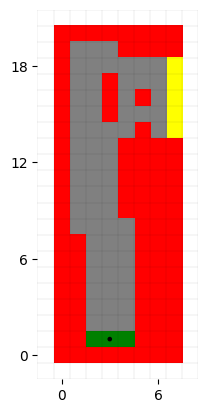

# Reinforcement Learning

Consider driving a race car in a race track as shown in the excel sheet . The car will always be at any one of the
discrete grid positions shown in the sheet. The green grids 1,2, 3 marks any of the starting positions . The orange
grids a,b,c,d,e marks any of the ending positions. The blue grid represent valid positions the car can take. The red
grids represents the boundaries. The velocity is discrete and is the number of grid cells moved horizontally and
vertically per time step. The actions are increments to velocity components. The horizontal and vertical components
may be changed by -1, 0 or 1 during a time step. Thus the actions are selected from a total of 3x3 possible actions.
Both velocity components follow the following constraints

- 0 ≤ 𝑣𝑥 ≤ 5 ; 0 ≤ 𝑣𝑦 ≤ 5 (Clip the velocity in case it crosses boundaries)
- 𝑣<𝑥 and 𝑣𝑦 cannot both be zero except at the start line.

Each episode begins at randomly selected start lines and ends when the car reaches any of the states in finish line.
The rewards are -1 for each time step until the car crosses the finish line. If the car intersects any of the red boundary
grids, the car will be reset randomly to any of the starting positions in green. Both the velocity components will be
reduced to zero and the episode continues. (Before updating car’s location check to see if car intersects finish line or
boundary). If car intersects orange finish line, episode ends. If the car intersects red boundary, it will get reset.

# How to run code

- Its a jupyter notebook, you just have to run all cell
- It takes around 2 hrs to run the whole notebook